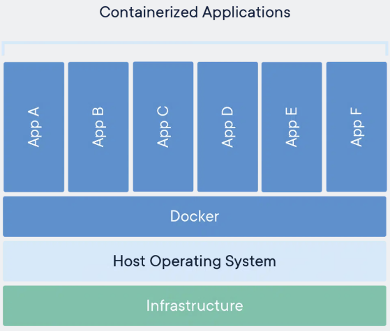

# Tutorial de Docker

1. docker run -d -p 80:80 docker/getting-started
`-d` - corre el contenedor en modo "separado" (detached), es decir, en background
`-p 80:80` - mapea el puerto 80 del host, en el puerto 80 en el contenedor
`docker/getting-started` - la imagen a ser usada
<sub>**Nota:** las flags pueden ser unidas para un comando mas compacto `docker run -dp 80:80 docker/getting-started` </sub>

2. Una vez hayamos corrido el comando anterior, vamos a un browser y buscamos la siguiente dirección para continuar el tutorial > `localhost:80`

3. Se recomienda apoyarse en el Dashboard de `Docker Desktop` donde vamos a tener una vision de contenedores, imagenes, y acceder facilmente a pociones del ciclo de vida del contenedor.

pero...

## ¿Qué es un Contenedor?
Es una unidad de software que **empaca el código y todas sus dependencias** para que la aplicacion pueda correr de forma confiable de un entorno de computacion a otro.

<div align="center">
    
</div>

## ¿Qué es una Imagen de Contenedor?
Al correr un contenedor, se corre un `Sistema de Archivos` aislado. Este sistema de archivos de despliega gracias a la `Imagen del Contenedor`. La imagen debe contener todos los requerimientos para correr la aplicacion: 
- Todas las dependencias
- Configuracion
- Scripts
- Binarios y demas
- **Variables de Entorno**
- **Comandos a correr**
- **Metadata**

---

## 1. Aplicacion del Tutorial
Se va a realizar una Lista de Tareas o ToDo List usando 


**Descargar el codigo fuente [aqui](http://localhost/assets/app.zip).**
```
    curl -o myfile.zip "some URL"           #descarga de la web
    unzip myfile.zip -d "some directory"    #unzip al archivo
    rm -f myfile.zip                        #remueve el zip descargado
```

### Construir el Container Image de la APP
Para construir la aplicacion, necesitamos el `Dockerfile`. Un `Dockerfile` es un script de instrucciones que se usan para crear una imagen de contenedor.

1. Crear un archivo `Dockerfile` en la carpeta donde esta `package.json`
```
    FROM node:12-alpine
    # Adding build tools to make yarn install work on Apple silicon / arm64 machines
    RUN apk add --no-cache python2 g++ make
    WORKDIR /app
    COPY . .
    RUN yarn install --production
    CMD ["node", "src/index.js"]
```
2. Abrir una terminal y construir la imagen del docer usando `docker build -t getting-started .`
   - `node:12-alpine` descarga `layers` de la imagen del lenguaje
   - `yarn` instala las dependencias de la aplicacion
   - `CMD` especifica el comando a correr por defecto cuando inicializamos el contenedor
   - `-t` esta flag taggea nuestra imagen de una forma legible para los usuarios
   - ` .` le indica a Docker que busque el archivo `Dockerfile` en el directorio actual

### Inicializar el Contenedor de la App
Lo siguiente es corre la aplicacion usando el comando `docker run`.

1. Inicializar el contenedor y especificar la imagen creada.
```
    docker run -dp 3000:3000 getting-started
```

2. Abrir la aplicacion, abriendo en el buscador `http://localhost:3000`
3. Probar la aplicacion agregando elementos a la lista de tareas

Hasta este punto ya tenemos una imagen de docker funcional, que despliega una aplicacion de TodoList usando node.js.

---
## 2. Actualizando la Aplicacion

Un lider de equipo solicita que agreguemos una caracteristica al codigo, esto es , cambiar el "empty text" cuando no tenemos ningun elemento en la lista.

1. Actualizar el codigo fuente en `src/static/js/app.js` en la linea 56
```
-                <p className="text-center">No items yet! Add one above!</p>
+                <p className="text-center">You have no todo items yet! Add one above!</p>
```
2. Correr la version actualizada de la imagen usando `docker build -t getting-started .`
3. Inicializamos un nuevo contenedor usando el codigo actualizado `docker run -dp 3000:3000 getting-started`

> Al correr el comando del punto 3 resulta en error, y esto es porque nuestro maquina host solo puede escuchar a una aplicacion a la vez por puerto, por lo tanto, debemos remover el contenedor viejo.


#### Removiendo un Contenedor Antiguo
1. Buscar el ID del contenedor usando el siguiente comando `docker ps`
2. Usar el siguiente comando para detener el contenedor `docker stop <container-id>`
3. Una vez se ha detenido el contenedor, lo removemos usando el comando `docker rm <container-id>`
    * **Forzar Remocion:** Podemos forzar la detencion y remocion de un contenedor agregando la flag "forzar" asi: `docker rm -f <container-id>`
    * **Remover desde el Dashboard:** Usando la interfaz de Docker Desktop, simplemente vamos directamente al contenedor y presionamos la opcion DELETE.

#### Inicializar el Contenedor de la App Actualizada
1. Inicialicemos nuevamente el contenedor `docker run -dp 3000:3000 getting-started`
2. Actualizamos el buscador en el `localhost:3000`.

Esta es una alternativa, sin embargo, no es la mas optima ya que debemos realizar muchos pasos intermedios para desplegar nuestra aplicacion nuevamente despues de una actualizacion, adicionalmente, no hay un almacenamiento persistente, ya que al actualizar la aplicacion, los elementos creados se eliminaron.

---
## 3. Compartiendo la Aplicacion
Para compartir nuestra imagen, se debe realizar un registro. Docker suministra registros a traves de [`DockerHub`](https://hub.docker.com/).

#### Crear un Repo
Para hacer push de una imagen, debemos crear el repo en DockerHub.
1. Ir a [DockerHub](https://hub.docker.com/).
2. Click en `Create Repository`
3. Nombrar el repo `getting-started`, revisar que sea un repo `public`.
4. Click en `Create`

En la mano derecha de la pagina, hay un snippet que nos muestra como hacer push a ese repositorio en particular, para esta app es > `docker push docker/getting-started:tagname`

#### Hacer Push a la imagen
1. En el CLI, tratamos de correr el comando push suministrado por DockerHub, sin embargo encontraremos con el error:
```
    $ docker push docker/getting-started
    The push refers to repository [docker.io/docker/getting-started]
    An image does not exist locally with the tag: docker/getting-started
```
Esto nos indica que el comando push estaba buscando una imagen llamada `docker/getting-started` pero no la encontro, validamos que no existe usando `docker image ls`

Tambien es posible encontrar un error de acceso como el siguiente:
```
    errors:
    denied: requested access to the resource is denied
    unauthorized: authentication required
```
2. Para solucionar los errores anteriores, debemos hacer login a DockerHub mediante el comando `docker login -u <username>` y hacer un taggeo de la imagen existente.
3. Para hacer tag de la imagen, usamos el comando `docker tag` para asignarle un nombre asi:
```
    docker tag getting-started nuestro-usuario/getting-started`
```
4. Una vez hayamos hecho login, y hayamos taggeado la imagen, podemos intentar nuevamente hacer el push `docker push juangilpragma/getting-started`

#### Correr la imagen en una nueva instancia
Ahora que ya publicamos nuestra imagen y ha sido registrada, validemos que funciona en una instancia que nunca ha estado en contacto con nuestra imagen. Docker suministra un entorno llamado `Play with Docker`.
1. Ir al navegador y buscar [Play with Docker](https://labs.play-with-docker.com/).
2. Login con la cuenta de DockerHub.
3. Click en `+ ADD NEW INSTANCE`.
4. En la terminal, llamar el comando `docker run -dp 3000:3000 juangilpragma/getting-started`

---
## 4. Persistiendo nuestra DB
Hasta el momento, el contenedor no persiste las acciones que realizamos sobre la aplicacion, por tanto es necesario usar el...

#### Sistema de Archivos del Contenedor
Cuando un contenedor corre, usa varias capas de la imagen para su filesystem. Cada contenedor tiene su *scratch space* para create/update/remove archivos, sin embargo, ningun cambio se vera reflejado en otro contenedor asi esten usando la misma imagen.

1. **En la Practica** vamos a crear dos contenedores y vamos a crear un archivo en cada uno, para visualizar que los archivos creados en un contenedor no son visibles para el otro.
   1. Crear un contenedor de `ubuntu` que cree un archivo llamado `/data.txt` y que contenga un numero aleatorio entre 1 y 10.000.
   `docker run -d ubuntu bash -c "shuf -i 1-10000 -n 1 -o /data.txt && tail -f /dev/null"`
   Este codigo inicializa un shell de bash e invoca dos comandos concatenandolos con `&&`. La primera porcion genera un numero aleatorio y lo escribe en el archivo /`data.txt`. El segundo comando es para mantener el contenedor corriendo.
   2. Para validar el output, podemos ir al Docker Dashboard, luego ver el contenedor creado recientemente y hacer click en el boton `open in terminal`, y luego correr el comando `cat /data.txt`. Tambien podemos hacer este procedimiento desde la terminal llamando el comando `docker exec <container-id> cat /data.txt`
   3. Creemos un nuevo contenedor de `ubuntu` usando la misma imagen con el comando `docker run -it ubunt ls /`, lo que veremos es que no existe nunbun archivo o directorio, con un error asi `ls: cannot access 'C:/Program Files/Git/': No such file or directory`
   4. Para limpiar el espacio, removamos el contenefor con `docker rm -f <container-id>`

#### Volumenes del Contenedor
Cada contenedor inicia con la definicion de la imagen con cada arranque. Los contenedores pueden crear, actualizar y eliminar archivos, pero dichos cambios se pierden una vez el se remueve el contenedor, aislando dichos cambios. Para cambiar esto, se usan los `Container Volumes`.
Estos **volumenes** dan la habilidad de conectar directorios de sistemas de archivos del contenedor de regreso a la maquina host. Si se monta el contenedor, dichos cambios son reflejados en la maquina host. En el tutorial, inicialmente se explica `named volumes`. Un `named volume` es como un `bucket`, en el cual Docker almacena la ubicacion fisica en el disco, y solo tenemos que recordar el nombre del volumen. Cada vez que este volumen es usado, Docker se asegura que los datos pasados son los adecuados.

##### Persistiendo los datos de nuestra aplicacion
La aplicacion guarda los archivos en un engine de SQLite en `etc/todos/todo.db`. La idea es generar estas base de datos, persistirla en la maquina host, y disponibilizarla al contenedor siguiente. Esto se hace por medio de la creacion de un volumen y agregandolo (montandolo) en el directorio que almacena los datos, de esta manera podemos persistir nuestros datos.

1. Crear un volumen con el comando `docker volume create todo-db`
2. Detener la aplicacion del Contenedor en el dashboard o usando `docker rm -f <container-id>`
3. Inicializar el Contenedor de la App agregando la flag `-v` para especificar el volumen a montar. Usamos el `named volume` y lo montamos en `/etc/todos`, donde se captura todos los archivos creados en el directorio.
```
    docker run -dp 3000:3000 -v todo-db:/etc/todos getting-started
```
4. Una vez se haya inicializado el contenedor, probemos agregando en la aplicacion algunos elementos en la lista.
5. Remover el contenedor de la app todo. Podemos usar el dashboard o usar el comando `docker ps` para obtener el ID y luego `docker rm -f <container-id>`
6. Reinicializar el contenedor con el comando del punto 3.
7. Al abrir la app podemos evidenciar que las tareas creadas antes de detener el contenedor siguen persistiendo.
8. Podemos remover libremente el contenedor para liberar espacio.

##### Consultando los Volumenes
Para inspecionar donde estan montados los volumenes que creamos, podemos usar el comando `docker volume inspect <nombre del volumen>`. El volumen se monta fisicamente en la maquina host y puede ser encontrado en la direccion de la llave `Mountpoint`.

## 5. Usando Bind Mounts
Los `named volumes` son una buena herramienta para almacenar los datos de nuestra aplicacion, sin preocuparnos de donde se almacenan dichos datos.

Con `bind mounts` controlamos exactamente el `Mountpoint` en la maquina host. Esto es usado tanto para persistir datos, como para proveer datos adicionales al contenedor. De esta manera, usamos `bind mounts` para:
1. Persistir datos
2. Montar datos propios
3. Montar codigo fuente en el contenedor
   1. Ver cambios en dicho codigo fuente, y actualizar.

#### Comparativo de Tipos de Volumenes
| Description | Named Volumes | Bind Mounts |
| :---: | :---: | :---: |
| Host Location | Docker chooses | We control |
| Mount Example (using -v) | my-volume:/usr/local/data | /path/to/data:/usr/local/data |
| Populates new volume with container contents | Yes | No|
| Supports Volume Drivers | Yes | No |

#### Inicializar un Contenedor en Dev-Mode
Para correr un contenedor que soporte flujos de trabajo de desarrolo, se hace lo siguiente:
- Montar nuestro codigo fuente en el contenedor
- Instalar todas las dependencias, incluyendo las dependencias "dev"
- Inicializar [nodemon](https://www.npmjs.com/package/nodemon) para monitorear cambios la filesystem.

1. Verificar que no haya ningun contenedor `getting-started` corriendo
2. Validar que estamos en el directorio de la app, de lo contrario hacer `cd` hacia el directorio.
3. Dentro del directorio de la app, correr el comando:
```
    docker run -dp 3000:3000 \
        -w /app -v "$(pwd):/app" \
        node:12-alpine \
        sh -c "yarn install && yarn run dev"
``` 
Si no funciona el comando anterior, usar `powershell` y correr este comando
```
    docker run -dp 3000:3000 `
        -w /app -v "$(pwd):/app" `
        node:12-alpine `
        sh -c "yarn install && yarn run dev"
```
El codigo anterior se desagrega asi:
- `dp 3000:3000` - Correr en modo separado (background) y crear un mapeo del puerto.
- `w /app` - Define el directorio actual desde donde va a correr el comando.
- `-v "$(pwd):/app` - Vinculo del `bind mount` en el directorio host `getting-started/app` para el directorio del contenedor `/app`. Recordar que docker necesita directorios absolutos para la app.
- `node12:alpine` - Imagen usada. Esta es la imagen base usada por nuestra app en Dockerfile.
- `sh -c "yarn install && yarn run dev` - El comando a correr. Inicializamos el shell usando `sh` (alpine no tiene bash) y corremos `yarn install` para installar todas las dependencias. Luego corremos `yarn run dev`. Podemos revisar el archivo `pacakge.json` para ver que el script corre en `nodemon`.

4. Validemos los logs usndo `docker logs -f <container-id>`. Estamos listos si vemos el siguiente input
```
    docker logs -f <container-id>
    $ nodemon src/index.js
    [nodemon] 1.19.2
    [nodemon] to restart at any time, enter `rs`
    [nodemon] watching dir(s): *.*
    [nodemon] starting `node src/index.js`
    Using sqlite database at /etc/todos/todo.db
    Listening on port 3000
```

5. Validemos haciendo cambios en la app `src/static/js/app`, actualizando la linea 109.
```
-                         {submitting ? 'Adding...' : 'Add Item'}
+                         {submitting ? 'Adding...' : 'Add'}
```
6. Refrescamos el navegador para validar el cambio.
7. Despues de hacer los cambios deseados, detenemos el container `docker rm -f <container-id>` y construimos la nueva imagen usando `docker build -t getting-started .`

Ahora podemos tener contenedores con aplicaciones funcionales, actualizables y que tengan bases de datos persistentes. El desafio ahora es enviar a **Produccion**, por tanto, necesitamos escalar nuestra base de datos ya que SQLite no es tan robusta para entornos productivos, tal vez usando MySQL. En la siguiente seccion se validara este tipo de cambios.


---
## 5. Multi-Container Apps